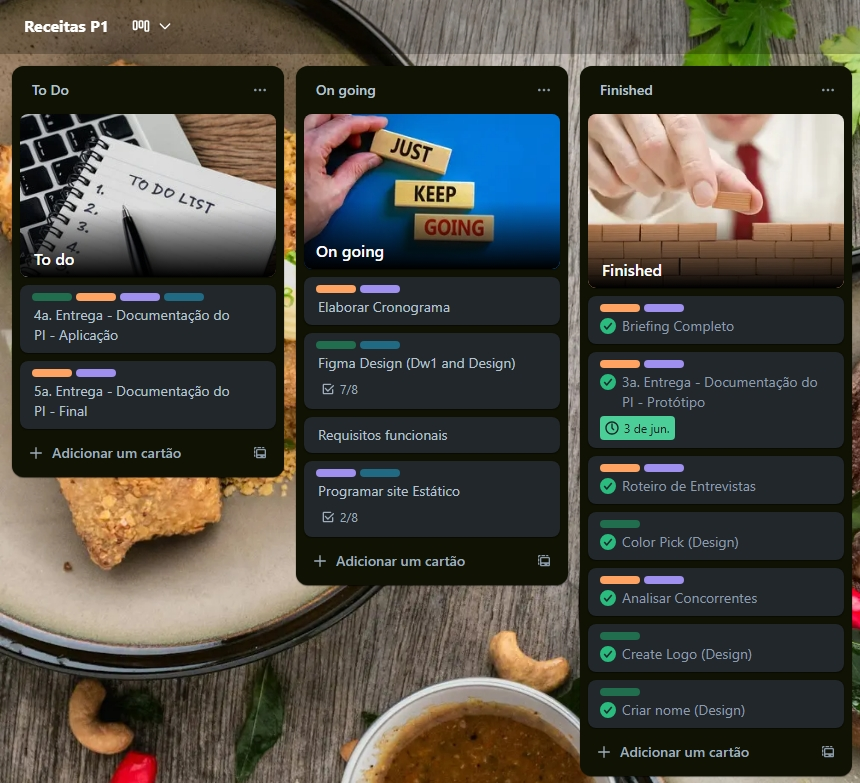
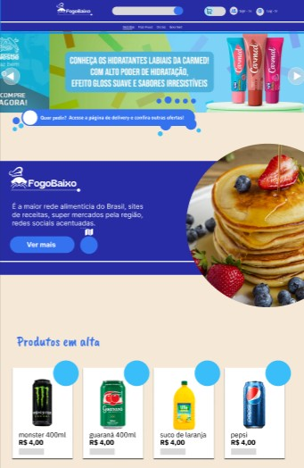

# 🍲 Fogo Baixo  
**Projeto para atender necessidades na área da alimentação**

    Centro Paula Souza 
    Faculdade de Tecnologia de Jahu 
    <h2>Curso de Tecnologia em Desenvolvimento de Software Multiplataforma</h2>
    <h2>Início: 1º Semestre / 2025</h2>

Documento da aplicação web

---

## 📖 Sumário
- [Descrição da Aplicação Web](#-descrição-da-aplicação-web)  
- [Objetivos](#-objetivos)  
- [Documento de Requisitos](#-documento-de-requisitos)  
- [Regras de Negócio](#-regras-de-negócio)  
- [Design](#-design)  
- [Modelo de Navegação](#-modelo-de-navegação)  
- [Prototipagem](#-prototipagem)  
- [Aplicação](#-aplicação)  
- [Considerações Finais](#-considerações-finais)  

---

## 🌐 Descrição da Aplicação Web

### 1.1 Descrição
Este projeto consiste no desenvolvimento de uma **aplicação web completa de delivery**, dinâmica e interativa.  
Principais funcionalidades:  
- Acompanhamento em tempo real da **localização do mercado, cliente, entregador e produto**.  
- **Cadastro de usuários** e integração de toda a rede.  
- Diferencial: **interatividade com receitas** e conexões com **redes sociais**, ampliando a experiência para além do simples processo de entrega.  

### 1.2 Métodos Utilizados (Front-End)
- **HTML5, CSS3, JavaScript**  
- **Tailwind CSS** → interfaces responsivas e consistentes  
- **Figma** → prototipagem e design de telas  
- **Scrum** → metodologia ágil baseada em sprints curtos e iterativos  

### 1.3 Cronograma do Projeto
📌 O cronograma detalhado está disponível em:  
👉 **[Receitas P1 | Trello](#)**  

---

## 🎯 Objetivos

### 2.1 Geral
Oferecer um **ambiente digital eficiente e dinâmico** para delivery, fortalecendo a marca e proporcionando **experiência diferenciada ao usuário**.  

Recursos adicionais:  
- Cupons, descontos e promoções  
- Acompanhamento em tempo real  
- Suporte direto  
- Receitas integradas às redes sociais  

---

## 📑 Documento de Requisitos

Um **documento de requisitos de sistema** registra as especificações que o sistema deve atender, servindo como guia para equipe e stakeholders.  

### 3.1 ✅ Requisitos Funcionais (RF)

| Código | Descrição |
|--------|------------|
| RF01 | Cadastrar usuário |
| RF02 | Login e logout de usuários |
| RF03 | Gerenciar perfil do usuário |
| RF04 | Pesquisar produtos |
| RF05 | Exibir catálogo de produtos |
| RF06 | Adicionar produtos ao carrinho |
| RF07 | Finalizar pedido |
| RF08 | Acompanhar status do pedido |
| RF09 | Cadastrar e gerenciar receitas |
| RF10 | Visualizar receitas |
| RF11 | Interagir com receitas |
| RF12 | Página institucional |
| RF13 | Página de contato |
| RF14 | Página “Quem somos” |
| RF15 | Sistema de cupons/descontos |
| RF16 | Administração de pedidos e estoque |

---

### 3.2 ⚙️ Requisitos Não Funcionais (RNF)

| Código | Descrição |
|--------|------------|
| RNF01 | Usabilidade (site intuitivo e responsivo) |
| RNF02 | Desempenho (carregamento rápido) |
| RNF03 | Acessibilidade (WCAG, navegação por teclado, etc.) |
| RNF04 | Compatibilidade (multiplataforma e navegadores) |
| RNF05 | Segurança (criptografia, HTTPS, autenticação) |
| RNF06 | Manutenibilidade (código modular e documentado) |
| RNF07 | Escalabilidade |
| RNF08 | Reutilização de componentes |
| RNF09 | Alta disponibilidade |
| RNF10 | Backup e recuperação de dados |

---

### 3.3 📌 Casos de Uso
*(Inserir tabela/diagrama de casos de uso)*  

---

## 📊 Regras de Negócio

### 4.1 O que será realizado?
- Receitas personalizadas por perfil, restrições e objetivos  
- Plataforma colaborativa, simples e acessível  

### Parcerias-Chave
- Influenciadores e nutricionistas  
- Mercado (dono do projeto)  
- Plataformas de pagamento  
- Serviços de hospedagem  

### Atividades-Chave
- Desenvolvimento e atualização da plataforma  
- Gestão de parcerias com mercados e entregadores  
- Suporte técnico e atendimento ao cliente  
- Criação e curadoria de conteúdo (receitas e promoções)  
- Estratégias de marketing digital  

### Proposta de Valor
- Plataforma de delivery dinâmica, eficiente e responsiva  
- Acompanhamento em tempo real  
- Cupons, descontos e promoções exclusivas  
- Suporte direto para dúvidas e problemas  
- Interatividade via receitas e redes sociais  

### Segmentos de Clientes
- Consumidores de delivery  
- Mercados e estabelecimentos locais  
- Pequenos produtores de alimentos  
- Usuários interessados em culinária caseira  
- Entregadores autônomos  

### Canais
- Aplicação web responsiva  
- Redes sociais (Instagram, Facebook, TikTok)  
- E-mail marketing e push notifications  
- Programas de indicação  

### Relacionamento com o Cliente
- Atendimento via chat ou FAQ  
- Programas de fidelidade  
- Conteúdo interativo (receitas, promoções)  
- Suporte rápido e personalizado  

### Fontes de Receita
- Taxa sobre pedidos  
- Parcerias com mercados  
- Espaço publicitário na plataforma  
- Programas premium para usuários  
- Parcerias com marcas de alimentos  

### Recursos-Chave
- Equipe de desenvolvimento  
- Infraestrutura tecnológica (servidores, banco de dados, APIs)  
- Integração com pagamentos online  
- Base de usuários ativos  
- Conteúdo de receitas  

### Estruturas de Custo
- Desenvolvimento e manutenção  
- Hospedagem e APIs  
- Marketing digital  
- Suporte e atendimento  
- Parcerias e fornecedores  

---

### 4.2 BM Canvas
- Modelo de negócios canva, organizando visualmente os objetivos e necessidades do projeto.

## 🎨 Design

- **Paleta de cores:** *(a ser definida)*
- 
- **Tipografia:** *(a ser escolhida)*
- 
- **Logo:** *(template inicial)*
- 

### 4.4 Wireframe
Wireframe disponível no Figma:  
👉 [Acessar Wireframe](https://www.figma.com/design/pcAL45RIRkzJonJIfegYL8/Wireframe---Protocolo-Rural?node-id=0-1&t=fn86gsElgTURtnbu-1)  

---

## 🧭 Modelo de Navegação
*(Inserir imagem e descrição do modelo de navegação)*  

---

## 🖌️ Prototipagem
Protótipo criado no Figma:  
👉 [Acessar Protótipo](https://www.figma.com/design/vUViGgaIlrKPADdi3aWy3O/Untitled?node-id=0-1&t=ATtDGzXCgMVPFe7U-1)  

---

## 💻 Aplicação
Repositório do projeto disponível no GitHub:  
👉 [Acessar Repositório](#)  

---

## 📝 Considerações Finais
Durante o desenvolvimento do **Fogo Baixo**, utilizamos metodologias ágeis e iterativas, superando desafios de tempo e equipe reduzida.  
- Conversão de receitas em formatos digitais interativos  
- Organização em seções como *Painel de Controle*, *Avaliações* e *Resultados*  
- Ciclos curtos de desenvolvimento com Scrum  
- Expansão contínua de funcionalidades e banco de dados  

➡️ O projeto visa oferecer uma **abordagem inovadora na culinária e nicho de delivery brasileiro**, unindo tecnologia, praticidade e experiência gastronômica.  
